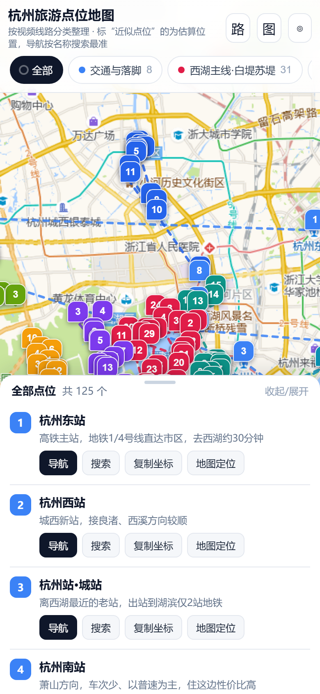

# 杭州旅游点位地图

一份可以直接在手机上打开、按线路分类浏览的杭州景点地图。点位来自一段杭州深度旅游攻略视频的整理，坐标经过交叉核对。

在线访问：**https://justaloneranger.github.io/hangzhou-travel-map/**



## 内容

共 **125 个点位**，按视频讲的线路分成 11 类：

| 分类 | 数量 | 说明 |
| --- | --- | --- |
| 交通与落脚 | 8 | 杭州东/西/南站、城站、机场、龙翔桥与凤起路地铁站、武林广场 |
| 西湖主线·白堤苏堤 | 31 | 断桥、白堤、平湖秋月、孤山、西泠印社、岳王庙、曲院风荷、苏堤、花港观鱼、太子湾、雷峰塔、净慈寺、九曜阁、柳浪闻莺、三潭印月及各处游船码头 |
| 西线·杨公堤上香古道 | 17 | 植物园、韩美林艺术馆、灵峰探梅、云松书舍、郭庄、茅家埠、上香古道、乌龟潭、浴鹄湾、霁虹桥 |
| 灵隐·天竺·北高峰 | 12 | 灵隐寺、飞来峰、永福寺、韬光寺、灵顺寺（北高峰索道）、三天竺、三生石 |
| 龙井·九溪·梅家坞 | 7 | 龙井村、十里琅珰、三分叉、梅家坞、云栖竹径、九溪十八涧、五云山 |
| 吴山·南宋皇城·美食 | 15 | 吴山景区、杭州博物馆、城隍阁、江湖汇观亭、德寿宫、胡雪岩旧居、南宋御街、清河坊、鼓楼、武林夜市、孩儿巷等 |
| 运河·拱宸桥 | 13 | 拱宸桥、桥西街区、扇/伞/刀剪剑/运河博物馆、香积寺、大兜路、小河直街、信义坊、武林门码头 |
| 西溪湿地 | 11 | 湿地公园、中国湿地博物馆、福堤、河渚街、深潭口、高庄、周家村、烟水渔庄、莲花滩观鸟区 |
| 良渚五千年 | 6 | 良渚古城遗址公园、博物院、文化村、美丽洲教堂、晓书馆、杭州国家版本馆 |
| 钱塘江·六和塔虎跑 | 4 | 六和塔、虎跑公园、钱塘江大桥、城市阳台 |
| 市外延伸·海宁观潮 | 1 | 盐官观潮胜地公园（看潮要去嘉兴海宁，市区看不到） |

## 手机怎么用

- 顶部按分类横滑切换，每个分类里点位按视频讲的游玩顺序编号，虚线就是建议的先后顺序
- 点任意点位，弹窗里有 **高德导航**（按名称搜索，最准）和 **按名称搜索** 两个按钮，直接唤起手机高德
- 底部列表可展开收起，每个点位带一句视频里的实用提示
- 右上三个按钮：路线连线开关、标准图/卫星图切换、定位到我

## 点位精度说明

- 大部分坐标来自 OpenStreetMap 的实体数据，并用高德地图瓦片上的地名注记做了交叉校验，与手机导航一致
- 有 **12 个点位标着"近似点位"**（岳庙码头、少年宫码头、玉涧桥、霁虹桥、三分叉等），这些在地图数据里没有权威坐标，是按上下文估算的，出行请以"按名称搜索"的结果为准
- 门票、预约、开放时间经常变，出发前请再确认一次

## 技术说明

单文件网页，地图库（Leaflet）已内嵌，不联网也能打开查看点位与说明，只有底图需要联网。底图使用高德瓦片，坐标采用 GCJ-02 与 WGS84 转换后显示。

重新生成页面：

```bash
cd src
python build_map.py     # 需要同级目录下 work/vendor 里的 leaflet.js 与 leaflet.css
```

`src/poi_data.py` 里是全部点位与说明的原始数据，可以直接改。

## 免责声明

点位与路线是个人旅行整理，仅供参考，不构成商业导览；如涉及版权或事实错误，欢迎提 Issue 指正。
